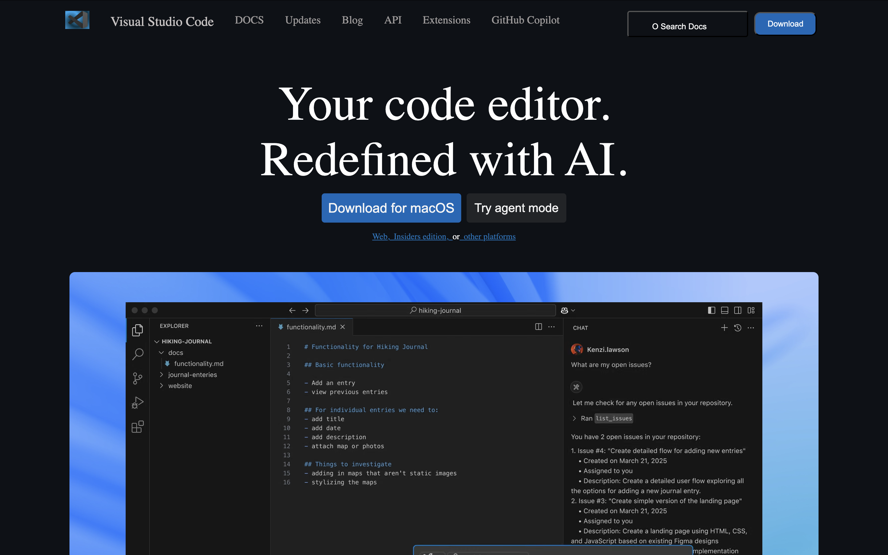

# 🔵 Visual Studio Code Clone (HTML + CSS)

This is a clean front-end-only clone of the [Visual Studio Code homepage](https://code.visualstudio.com/), built using pure **HTML** and **CSS**.  
It includes responsive design elements, a navbar, button styles, image overlays, and a video background — all without any JavaScript.

---

## 🎯 Features

- ✅ Modern Navbar with logo and section links (Docs, Updates, Blog, API, etc.)
- ✅ Call-to-action buttons for "Download" and "Search Docs"
- ✅ Hero section with **large animated heading**
- ✅ Clean and professional **VS Code UI color palette**
- ✅ Full-width image + overlayed autoplay video using HTML5 `<video>`
- ✅ Completely static — No JS required

---

## 🧠 Tech Stack

- **HTML5**
- **CSS3 (inline styling for rapid prototyping)**
- **No frameworks, no libraries**

---

## 📸 Screenshots

---

## 🛠 Folder Structure