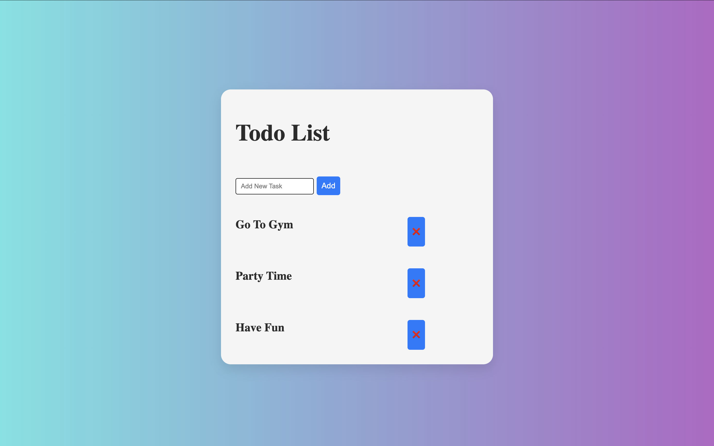

# ✅ Todo List Web App

A simple and elegant Todo List application built using **HTML**, **CSS**, and **Vanilla JavaScript**.  
It allows users to add and delete tasks dynamically with a smooth UI experience.

---

## 🧠 Features

- ✅ Add tasks using input field or **Enter key**
- ✅ Remove tasks with a delete (❌) button
- ✅ Preloaded sample tasks for demonstration
- ✅ Stylish UI with gradient background and card-like task layout
- ✅ Fully responsive and lightweight

---

## 🛠️ Technologies Used

- **HTML5**
- **CSS3**
- **JavaScript (DOM Manipulation)**

---

## 📸 Screenshots

---